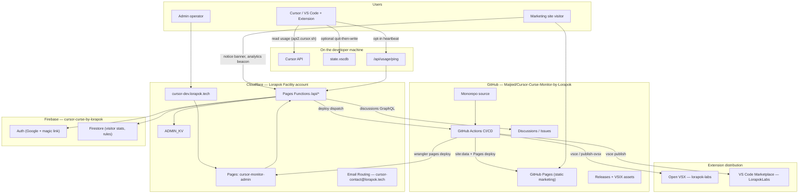

<div align="center">

  

  <h1>Cursor Curse Monitor by Lorapok</h1>

  <p>
    <strong>Live Cursor usage dashboard for limits, budget, billing cycles, and free-fallback model switching.</strong>
  </p>

  <p>
    <a href="https://lorapok.tech">Lorapok Labs</a> · Built for Cursor IDE &amp; VS Code
  </p>

  <p>
    <a href="https://github.com/Maijied/Cursor-Curse-Monitor-by-Lorapok/actions"></a>
    <a href="https://open-vsx.org/extension/lorapok-labs/cursor-curse-monitor-by-lorapok"></a>
    <a href="https://marketplace.visualstudio.com/items?itemName=LorapokLabs.cursor-curse-monitor-by-lorapok"></a>
    
    
  </p>

  <p>
    <a href="https://github.com/Maijied/Cursor-Curse-Monitor-by-Lorapok/releases/latest"></a>
    <a href="https://maijied.github.io/Cursor-Curse-Monitor-by-Lorapok/">Website</a> ·
    <a href="https://cursor-dev.lorapok.tech">Admin</a> ·
    <a href="DEPLOYMENT.md">Deployment</a>
  </p>

</div>

---

## Overview

**Cursor Curse Monitor by Lorapok** helps developers track Cursor AI usage in real time — included limits, remaining quota, billing cycle reset, on-demand spend, and optional fallback to **Composer 2.5 (Fast off)** when limits are exceeded.

This repository is a **monorepo** with three production surfaces:

| Component | Path | Public URL |
|-----------|------|------------|
| **Extension** | `src/` | Open VSX · VS Code Marketplace · GitHub Releases |
| **Marketing site** | `website/` | https://maijied.github.io/Cursor-Curse-Monitor-by-Lorapok/ |
| **Admin (Mission Control)** | `website/admin/` | https://cursor-dev.lorapok.tech |

---

## Architecture

### System diagram



### Domains & hosting

| Surface | Domain / host | Provider | Deploy path |
|---------|---------------|----------|-------------|
| Marketing website | `maijied.github.io/Cursor-Curse-Monitor-by-Lorapok` | **GitHub Pages** | `ci-cd.yml` → `website` job |
| Admin SPA + API | `cursor-dev.lorapok.tech` | **Cloudflare Pages** (project `cursor-monitor-admin`) | `ci-cd.yml` → `admin-deploy` job |
| Pages origin (fallback) | `cursor-monitor-admin-2x8.pages.dev` | Cloudflare Pages | Same as admin |
| Brand / DNS zone | `lorapok.tech` | **Cloudflare DNS** | CNAME `cursor-dev` → Pages |
| Extension registries | Open VSX, VS Code Marketplace | Third-party | `deploy` job on release |
| Auth & analytics store | Firebase project `cursor-curse-by-lorapok` | **Google Firebase** | Rules via `firebase deploy` |

**Cloudflare migration:** Admin and API were consolidated onto the **Lorapok Facility** Cloudflare account. DNS for `cursor-dev.lorapok.tech` points at the Pages project; the legacy standalone Worker in `website/admin-api/` is **deprecated** — all `/api/*` routes live in `website/admin/functions/api/`. See [DEPLOYMENT.md](DEPLOYMENT.md) for secrets, KV bindings, and the full checklist.

### Project structure

```
cursor-usage-monitor/
├── src/                          # VS Code / Cursor extension (TypeScript)
├── dist/                         # Compiled extension output
├── media/                        # Icons and marketing assets
├── scripts/
│   ├── generate-site-data.mjs    # Builds website/site-data.json
│   ├── generate-seo.mjs          # Builds website/seo.json
│   └── publish-ovsx.mjs          # Repacks VSIX for lorapok-labs namespace
├── tests/                        # Extension unit tests (node:sqlite)
├── website/
│   ├── index.html                # Marketing landing page
│   ├── site.js / analytics.js    # Client scripts (notice + beacon)
│   ├── site-data.json            # Generated marketplace + download stats
│   └── admin/
│       ├── src/                  # React Mission Control SPA
│       ├── functions/api/        # Cloudflare Pages Functions (production API)
│       └── vite-dev-api.mjs      # Local dev API middleware
├── .github/workflows/ci-cd.yml   # Unified CI/CD pipeline
├── DEPLOYMENT.md                 # Release + Cloudflare setup
└── AGENTS.md                     # Agent / cloud dev instructions
```

### Data flows (summary)

1. **Extension** — Reads local Cursor auth, calls `api2.cursor.sh`, optionally writes fallback model after quit with WAL-safe backups.
2. **Marketing site** — Static HTML on GitHub Pages; loads `site-data.json` for download counts and falls back only when `/api/notice` is unreachable.
3. **Admin** — Firebase-authenticated SPA on Cloudflare Pages; Pages Functions read/write KV (notices, admins), dispatch GitHub deploys, and proxy analytics.
4. **CI/CD** — One workflow builds the extension, regenerates site data, deploys GitHub Pages, and deploys the admin panel when Cloudflare secrets are configured.

---

## Features

| Feature | Description |
|--------|-------------|
| **Sidebar dashboard** | Activity bar → **Cursor Curse Monitor** |
| **Status bar** | Live usage percentage at a glance |
| **Auto refresh** | Polls Cursor API every 60s (configurable) |
| **Custom budget** | Set a personal USD cap in the dashboard |
| **Limit alerts** | Warning at 80% (configurable) |
| **Free fallback** | Auto-switches to Composer 2.5 (Fast off) at 100% |
| **Team aware** | Shows team vs individual limit type |
| **DB safety** | Read-only while Cursor runs; quit-then-write with WAL/SHM backup + integrity checks |

## Installation

### Open VSX (Cursor) — recommended

[open-vsx.org/extension/lorapok-labs/cursor-curse-monitor-by-lorapok](https://open-vsx.org/extension/lorapok-labs/cursor-curse-monitor-by-lorapok)

Search: `lorapok-labs.cursor-curse-monitor-by-lorapok`

### VS Code Marketplace

[marketplace.visualstudio.com/items?itemName=LorapokLabs.cursor-curse-monitor-by-lorapok](https://marketplace.visualstudio.com/items?itemName=LorapokLabs.cursor-curse-monitor-by-lorapok)

### From VSIX

```bash
git clone https://github.com/Maijied/Cursor-Curse-Monitor-by-Lorapok.git
cd Cursor-Curse-Monitor-by-Lorapok
npm install && npm run compile && npm run package
cursor --install-extension *.vsix
```

## Configuration

| Setting | Default | Description |
|---------|---------|-------------|
| `cursorCurseMonitor.pollIntervalSeconds` | `60` | API refresh interval |
| `cursorCurseMonitor.customBudgetLimit` | `0` | Personal USD budget cap |
| `cursorCurseMonitor.autoApplyFallbackModel` | `false` | Auto-switch at 100% (writes `state.vscdb`) |
| `cursorCurseMonitor.showStatusBar` | `true` | Show usage in status bar |
| `cursorCurseMonitor.statusBarUsageSource` | `autoApi` | `plan`, `autoApi`, or `both` |
| `cursorCurseMonitor.warnAtPercent` | `80` | Warning notification threshold |

## Development

```bash
npm install
npm run compile
npm test          # extension tests (Node 22+)
npm run package   # build .vsix
```

Press **F5** in Cursor/VS Code for the Extension Development Host.

**Admin panel (local):**

```bash
cd website/admin && npm install && npm run dev
# http://localhost:5173
```

See [website/admin/README.md](website/admin/README.md) and [AGENTS.md](AGENTS.md) for component-specific commands.

## CI/CD

Single workflow: [`.github/workflows/ci-cd.yml`](.github/workflows/ci-cd.yml)

| Trigger | Result |
|---------|--------|
| PR to `main` | Build, validate, package — no deploy |
| Push to `main` | Extension CI, admin build/deploy*, marketing site update |
| Manual dispatch | Version bump → marketplace publish → website |
| Tag `v*` | Marketplace deploy + GitHub Release + website |

\* Admin deploy requires `CLOUDFLARE_API_TOKEN` and `CLOUDFLARE_ACCOUNT_ID` in GitHub secrets.

Full setup: [DEPLOYMENT.md](DEPLOYMENT.md)

## Privacy

- Auth token stays on your machine; API calls go only to `api2.cursor.sh`
- Opt-in install heartbeat uses an anonymous `installId` when enabled
- No third-party analytics in the extension itself

[Privacy policy](https://maijied.github.io/Cursor-Curse-Monitor-by-Lorapok/privacy.html)

## Links

| Resource | URL |
|----------|-----|
| Website | https://maijied.github.io/Cursor-Curse-Monitor-by-Lorapok/ |
| Admin | https://cursor-dev.lorapok.tech |
| Open VSX | https://open-vsx.org/extension/lorapok-labs/cursor-curse-monitor-by-lorapok |
| VS Code Marketplace | https://marketplace.visualstudio.com/items?itemName=LorapokLabs.cursor-curse-monitor-by-lorapok |
| GitHub Releases | https://github.com/Maijied/Cursor-Curse-Monitor-by-Lorapok/releases |
| Lorapok Labs | https://lorapok.tech |

## Author

**Mohammad Maizied Hasan Majumder** (Maijied) — Founder & Principal Engineer @ [Lorapok Labs](https://lorapok.tech)

MIT © Lorapok Labs — see [LICENSE](LICENSE)

## Disclaimer

Independent open-source product by Lorapok Labs. Not affiliated with, endorsed by, or sponsored by Cursor / Anysphere.
