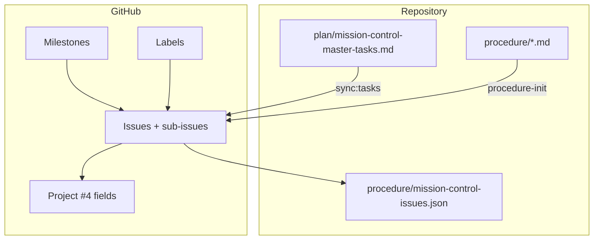

# Task tracking — Mission Control & GitHub Project

**Public board:** [Lorapok Labs : Team Planning : Cursor Curse Monitor](https://github.com/users/Maijied/projects/4)

Canonical registry: [`plan/mission-control-master-tasks.md`](plan/mission-control-master-tasks.md)

Deep guide: [`docs/guides/GITHUB_ISSUES_AND_PROJECT.md`](docs/guides/GITHUB_ISSUES_AND_PROJECT.md)

---

## Architecture



| Layer | Location | Role |
|-------|----------|------|
| **Registry** | `plan/mission-control-master-tasks.md` | Source of truth: task IDs, status, priority queue |
| **Issues** | GitHub Issues | Assignable work; parent/child sub-issues |
| **Milestones** | GitHub Milestones | Release themes (Auth, Mail, Infra, …) |
| **Labels** | `procedure/github-labels.json` | `type:*`, `area:*`, `priority:*`, `status:*` |
| **Project #4** | Custom fields | Status, Priority, Size, Iteration, dates |
| **Procedure** | `procedure/{id}_*.md` | Execution log during implementation |

---

## Maintainer commands

```bash
# Full professional setup (run after registry sync or board changes)
npm run sync:labels           # label taxonomy + remap legacy labels on open issues
npm run sync:tasks            # registry → issues + sub-issues + project items
npm run setup:github-project  # project README, milestones, priority/status fields

# Single new task
node scripts/procedure-init.mjs --title "AUTH-13 ACL audit UI" --component admin
```

---

## Issue hierarchy

```
Epic: Mission Control — open backlog (#126)
├── Epic: Firebase (#131)
│   └── [AUTH-13] ACL audit UI (#132)  ← P0
├── Epic: Mail …
│   ├── [MAIL-13] …
│   └── [MAIL-14] …
└── …
```

| Convention | Example |
|------------|---------|
| Epic title | `Epic: Mail (Resend + Cloudflare Email)` |
| Task title | `[AUTH-13] ACL audit UI` |
| Top epic | [#126](https://github.com/Maijied/Cursor-Curse-Monitor-by-Lorapok/issues/126) |

---

## Labels (taxonomy)

Synced from [`procedure/github-labels.json`](procedure/github-labels.json):

| Prefix | Meaning |
|--------|---------|
| `type:epic` / `type:task` | Hierarchy level |
| `area:*` | auth, mail, infra, extension, website, analytics, logs, admin |
| `priority:p0` / `p1` / `p2` | Mirrors Project **Priority** field |
| `status:partial` / `status:deferred` | Registry status |
| `mission-control` | All synced registry items |

---

## Milestones

Synced from [`procedure/github-milestones.json`](procedure/github-milestones.json):

| Milestone | Sections |
|-----------|----------|
| MC — Auth & ACL | Firebase |
| MC — Mail & Subscribers | Mail |
| MC — Infrastructure | Cloudflare * |
| MC — Discord | Discord |
| MC — Extensions | IDE + Browser |
| MC — Website | Marketing website |
| MC — Observability | Stats/Cron, Settings UX |
| MC — Operations | GitHub, Azure, GCP |

**Priority queue** (also sets Project Priority + `priority:*` labels):

- **P0:** AUTH-13
- **P1:** MAIL-13, MAIL-14, DC-06, DC-07, ANALYTICS-01, LOGS-01, EXT-01
- **P2:** all other open `next` / `partial` tasks

---

## Project #4 fields

Config: [`procedure/github-project-fields.json`](procedure/github-project-fields.json)

| Field | Values | Set by |
|-------|--------|--------|
| **Status** | Todo · In progress · Done | `setup:github-project` (partial → In progress) |
| **Priority** | P0 · P1 · P2 | priority queue |
| **Size** | XS–XL | manual |
| **Milestone** | MC — * | section mapping |
| **Iteration** | 2-week sprints | manual |
| **Sub-issues progress** | auto | GitHub |

**Views to create in UI:** Board (by Status), Table (by Priority), Roadmap (by Target date).

---

## Agent workflow

| Command | Action |
|---------|--------|
| **Update?** | Refresh registry + CI; report done / next / blocked |
| **next** | Implement top P0/P1 task; link PR to issue |
| **sync issues** | `npm run sync:tasks && npm run setup:github-project` |

**When completing a task:**

1. Mark **done** in `plan/mission-control-master-tasks.md`
2. Close issue; Project Status → **Done**
3. Update procedure **Verification**
4. `CHANGELOG.md` if user-visible

---

## Issue templates

| Template | Use |
|----------|-----|
| Mission Control task | New registry task (prefer `procedure-init`) |
| Bug report | Defects |
| Feature request | Ideas not yet in registry |

Templates: [`.github/ISSUE_TEMPLATE/`](.github/ISSUE_TEMPLATE/)

---

## Auth (one-time)

```bash
gh auth refresh -h github.com -s read:project,project
```

Config: [`procedure/project.json`](procedure/project.json) → `projectNumber: 4`

---

## Related

- [GitHub Issues docs](https://docs.github.com/en/issues)
- [Projects docs](https://docs.github.com/en/issues/planning-and-tracking-with-projects)
- [Labels](https://docs.github.com/en/issues/using-labels-and-milestones-to-track-work/managing-labels)
- [Milestones](https://docs.github.com/en/issues/using-labels-and-milestones-to-track-work/about-milestones)
- [Sub-issues](https://docs.github.com/en/issues/tracking-your-work-with-issues/using-issues/adding-sub-issues)
- [`.cursor/rules/procedure-github-project.mdc`](.cursor/rules/procedure-github-project.mdc)
