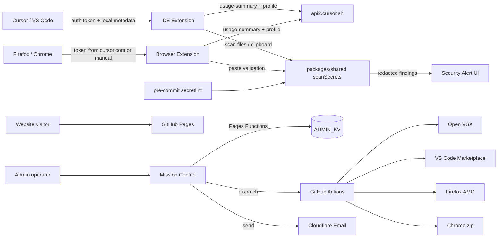
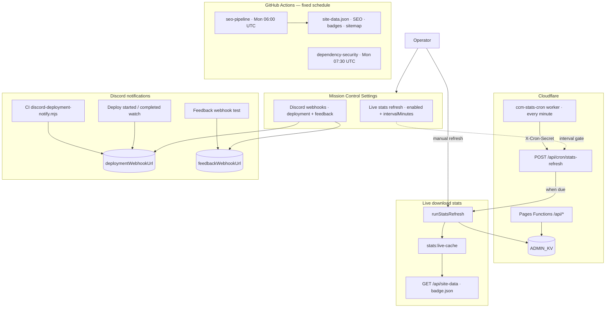

# Architecture

## Monorepo layout

```
cursor-usage-monitor/
├── src/                 # VS Code / Cursor extension (TypeScript)
├── packages/shared/     # Shared API types + budget math
├── browser-extension/   # Firefox AMO + Chrome zip WebExtension
├── website/             # Marketing static site (GitHub Pages)
│   └── admin/           # Mission Control SPA + Cloudflare Pages Functions
├── media/               # Extension & repo assets
└── docs/wiki/           # GitHub Wiki source (sync to wiki repo)
```

## Data flow



## Schedules & Discord

Weekly GitHub Actions jobs regenerate marketing data; Cloudflare `ccm-stats-cron` calls Mission Control every minute and respects the **Settings → Live stats refresh** interval in `ADMIN_KV`. Discord cards fire on deploy events, CI website/admin deploy, and feedback tests.



## IDE extension

- Quota and billing come from Cursor’s remote usage API after reading the local auth token in `state.vscdb`
- Local insights (read-only) include daily line-accept stats, active models, and composer session titles — not chat transcripts
- Status bar + sidebar dashboard; native workbench toasts overlay the open editor
- Optional Composer 2.5 fallback when limits exceeded (quit-then-write)
- **Security monitor** (`securityMonitor.ts`): pattern-based credential scan via shared `scanSecrets`; Manage Processes–style alert panel; commands for workspace and clipboard scan. Does not read live Composer chat.

## Browser extension

- Hybrid auth: content script on `cursor.com` captures Bearer token from `api2.cursor.sh` requests, or manual paste in Options
- Animated Budget Tracker popup; mandatory Lorapok Labs + Cursor footer
- **Security scanner** on Options paste — warns when extra secrets appear alongside an intentional Cursor token
- Firefox: auto-published to AMO via `publish-amo.mjs` (`web-ext sign` + generated metadata)
- Chrome: direct-download zip (not Chrome Web Store)

## Versioning

- Root `package.json` holds the production base semver
- Workspace packages use `0.0.0` in git; `npm run version:sync` resolves versions at build time
- CI and Mission Control releases run `version:sync` before packaging

## Security scanner (shared)

- Core engine: `packages/shared/src/scanSecrets.ts` — Bearer/JWT, API keys, private keys, password assignments, `.env` patterns
- Redaction: findings store `abcd…wxyz` snippets only; full matches are never logged or uploaded
- Repo: `.secretlintrc.json` + Husky pre-commit + CI `security:scan`
- **Limitation:** Composer chat secrets that never hit disk are not detectable

## Marketing site

- Static HTML + `site-data.json` / `seo.json` (generated by root scripts)
- OG image: `website/assets/marketing/og-social-card.png` (1200×630)
- GitHub social preview: `media/github-social-preview.png` (1280×640)

## Admin API

Authenticated `/api/*` routes on Cloudflare Pages Functions. Secrets in Pages environment / GitHub Actions.

[← Home](Home)
