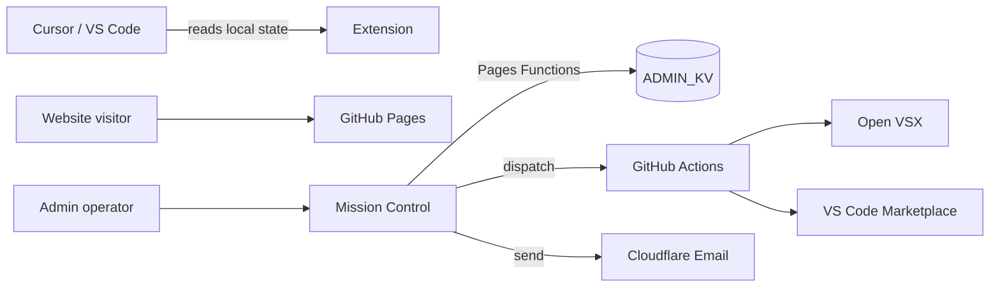

# Architecture

## Monorepo layout

```
cursor-usage-monitor/
├── src/                 # VS Code / Cursor extension (TypeScript)
├── website/             # Marketing static site (GitHub Pages)
│   └── admin/           # Mission Control SPA + Cloudflare Pages Functions
├── media/               # Extension & repo assets
└── docs/wiki/           # GitHub Wiki source (sync to wiki repo)
```

## Data flow



## Extension

- Reads Cursor usage from local workspace storage
- Status bar + sidebar dashboard
- Optional Composer 2.5 fallback when limits exceeded

## Marketing site

- Static HTML + `site-data.json` / `seo.json` (generated by root scripts)
- OG image: `website/assets/marketing/og-social-card.png` (1200×630)
- GitHub social preview: `media/github-social-preview.png` (1280×640)

## Admin API

Authenticated `/api/*` routes on Cloudflare Pages Functions. Secrets in Pages environment / GitHub Actions.

[← Home](Home)
