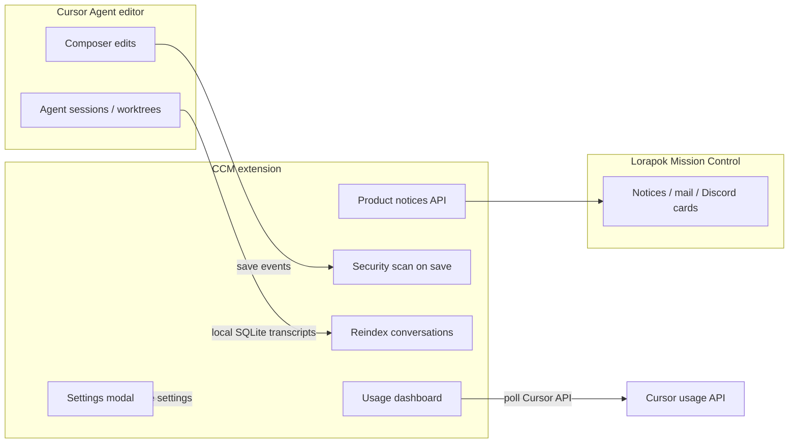

# Plan: Cursor Agent Editor + CCM Integration

**Branch:** `feat/multi-cursor-accounts`  
**Date:** 2026-08-29  
**Audience:** Lorapok engineers, Cursor users running Agent mode

---

## Goal

Use **Cursor Curse Monitor (CCM)** as the local control plane while **Cursor Agent** (composer/agent editor) edits the repo — usage guardrails, security, conversation recovery, and product notices without leaving the IDE.

---

## How they fit together

| Agent activity | CCM capability | User action |
|----------------|----------------|-------------|
| Long agent runs burn quota | Live usage + budget cap + warn % | Open dashboard; tune **Settings → warn at %** |
| Hits 100% included usage | Fallback model command | Enable **auto-apply fallback** (quit editor first) |
| Worktree / branch switch loses chats | Reindex missing conversations | Dashboard → **Reindex** (editor fully quit) |
| Agent writes secrets to files | Scan on save / block save | **Settings → security scan** |
| New release / incident | Product notices | **Settings → product notices** |
| Beta VSIX from Actions | Notice card `beta-tester-invite` | Install VSIX; send feedback via dashboard mail/GitHub |

---

## Phase 1 — Shipped in this change

- **Dashboard settings modal** (gear icon): poll interval, status bar, notices, security, telemetry opt-in — writes `cursorCurseMonitor.*` settings.
- **Shared message cards** (`scripts/message-cards.mjs`): one catalog drives email templates, extension notices, and Discord footer/feedback copy.
- **Main product logo** in all email categories (`/assets/icon.png`).
- **Notice templates** expanded: agent recovery, quota warning, beta invite, incident resolved, AMO pending, telemetry opt-in.

---

## Phase 2 — Agent-aware UX (next)

1. **Status bar agent hint** — when `local.sessions` shows active agent/composer mode, show a compact “Agent active · {usage}%” tooltip linking to dashboard.
2. **Post-reindex toast** — after `reindexConversations`, surface count of restored threads (already in command output → webview message).
3. **Notice targeting** — Mission Control notice metadata `audience: agent-users` so cards like `agent-editor-tip` prefer users on Cursor 0.4x+ with agent DB present.
4. **Command palette group** — `CCM: Agent tools` with Reindex, Scan workspace, Open dashboard settings.

---

## Phase 3 — Deeper agent integration (optional)

1. **Cursor hooks / rules** — document a `.cursor/rules` snippet that tells the agent to check CCM budget before large refactors (no auto-enforcement; user opt-in).
2. **MCP read-only bridge** — optional local MCP that exposes `getUsageSnapshot()` and `getSecurityFindings()` for custom agent workflows (separate repo concern; security review required).
3. **Cloud agent parity** — same notice cards rendered in admin for cloud-agent beta testers; feedback obeys shared `messageCatalog.footers`.

---

## Success metrics

- Dashboard settings modal used without opening VS Code Settings JSON.
- Discord deploy embeds include shared feedback block (no hardcoded one-offs).
- Email logo consistent with website `assets/icon.png`.
- Agent users who lose chats complete reindex flow from dashboard copy (`conversation-recovery` card).

---

## Files to know

| Area | Path |
|------|------|
| Message cards (source) | `scripts/message-cards.mjs` |
| Embedded catalog (runtime) | `website/admin/functions/api/_shared/product-context.embedded.json` |
| Runtime helpers | `website/admin/functions/api/_shared/message-cards-runtime.js` |
| Email branding | `website/admin/functions/api/_shared/mail-branding.js` |
| Discord notify | `website/admin/functions/api/_shared/discord-notify.js` |
| IDE settings modal | `src/dashboardView.ts`, `src/editorSettings.ts` |
| Regenerate embed | `node scripts/embed-product-context.mjs` |
