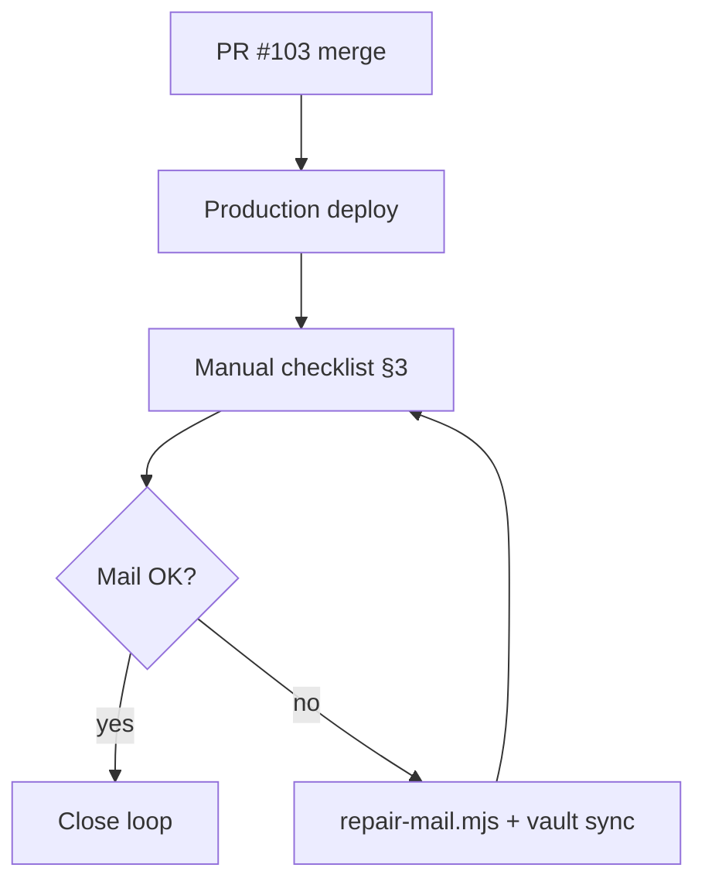

# Multi-issue fix & follow-up plan

**Status:** PR #102 merged · PR #103 merged  
**Branch:** `main` (follow-ups landed via [PR #103](https://github.com/Maijied/Cursor-Curse-Monitor-by-Lorapok/pull/103))  
**Last updated:** 2026-08-31

---

## 1. Completed (merged via PR #102)

| Area | Change | Verify |
|------|--------|--------|
| Package version | `generate-site-data.mjs` / SEO use resolved `version` for `packageVersion`; admin `resolvePackageVersion` ignores `0.0.0` placeholder | Mission Control Overview shows real version |
| Architecture | Removed legacy STEPS list; Mermaid CSS opacity-only (no `transform` on nodes) | Admin Architecture tabs render diagrams |
| API Explorer | Removed auto-run on page load; idle badge shows "Not tested" | Open page → no requests until Run |
| Sidebar | Brand header + collapsible footer | Collapse/expand works |
| Marketing site | Hero overlap + subscribe modal guards in `site.js` / CSS | Hero animation not over cards; subscribe works |
| Subscribe mail | `subscribe.ts` returns 502 when welcome email fails; surfaces `mailWarning` | Failed send shows error to user |
| CI noise | `site-data.js` local fallback; `SITE_DATA_FILE` in admin-ci | No `resolveProductContext` 403 spam in logs |

---

## 2. Merged via PR #103 (automated follow-ups)

| Item | Files | Acceptance |
|------|-------|------------|
| Vitest site-data path | `website/admin/vite.config.ts` (`test.env.SITE_DATA_FILE`) | Local `npm test` uses `website/site-data.json`, no remote fetch |
| packageVersion tests | `website/admin/src/lib/site-data.test.ts` | `0.0.0` → falls back to `version` |
| Subscribe API tests | `website/admin/src/__tests__/subscribe-api.test.ts` | Consent, mailbox entry, subscriber list |
| Dev probe parity | `website/admin/vite-dev-api.mjs` | `POST /api/subscribe` with `probe: true` matches production |

**CI gate:** Admin Panel CI green (verified on PR #103 merge deploy run).

---

## 3. Manual verification (post-merge #103)

Do these in production after deploy; check off when done.

### Mission Control (`https://cursor-dev.lorapok.tech`)

- [x] **Overview** — Package Version via `/api/site-data` *(verified 2026-08-31: `1.0.65`, not `0.0.0`)*
- [ ] **Architecture** — All Mermaid tabs render (requires signed-in browser)
- [ ] **API Explorer** — Idle on load (requires signed-in browser)
- [ ] **Sidebar** — Brand block + footer collapse (requires signed-in browser)
- [x] **Login SPA** — `/login` loads; “Sign in with Google” + keep-signed-in checkbox *(Playwright 2026-08-31)*

### Marketing site (`https://cursor.lorapok.tech`)

- [x] **Hero** — `.hero-visual` present; no overlap with hero cards at desktop viewport *(Playwright 2026-08-31)*
- [x] **Subscribe** — Inline form + modal with email, consent checkbox, Subscribe button *(Playwright 2026-08-31)*
- [x] **site-data.json** — `packageVersion` matches `version` on live URL *(verified 2026-08-31: `1.0.65` / `1.0.65`)*

### Mail pipeline

- [x] **Subscribe E2E (API)** — `mdshuvo40@gmail.com` → `emailed: true`, welcome resent *(2026-08-31; check inbox)*
- [ ] **Mailbox** — Outbound subscribe row in Mission Control Mailbox *(needs Google sign-in)*
- [ ] **Ops copy** — BCC/forward to ops inbox if configured (`MAIL_OPS_COPY`)
- [x] **Health** — `GET /api/health` → `mailConfigured: true` *(verified 2026-08-31: `cloudflare-relay`, relay bound)*
- [x] **Subscribe probe** — `POST /api/subscribe` with `probe: true` → 200 *(verified 2026-08-31)*

If mail fails: `node website/admin/scripts/repair-mail.mjs` (vault creds locally).

### Security

- [ ] **Vault passphrase** — Rotate if exposed in chat; re-sync with `npm run mail:sync-vault` in admin

---

## 4. Optional / backlog

| Item | Notes |
|------|-------|
| Delete stale branch | Done — `fix/multi-issue-version-arch-mail-ui` removed; delete `origin/chore/pr-102-followups` if still listed |
| Review git stashes | Done — stash list empty (2026-08-31) |
| Workspace file modes | Done — `git config core.fileMode false`; `git status` clean |
| Admin vitest locally | Some suites need `npm ci` + `npm run build -w @lorapok/cursor-monitor-shared` if `framer-motion` / shared resolve fails |
| Regenerate site artifacts | `npm run site:data && npm run site:seo` before release if marketplace numbers drift |

---

## 5. Execution order



---

## 6. Commands reference

```bash
# Local admin tests (from website/admin)
npm test

# Regenerate marketing data (repo root)
npm run site:data && npm run site:seo

# Fast admin deploy (preview)
npm run admin:deploy:fast

# Mail repair (needs Cloudflare + vault)
node website/admin/scripts/repair-mail.mjs
```
