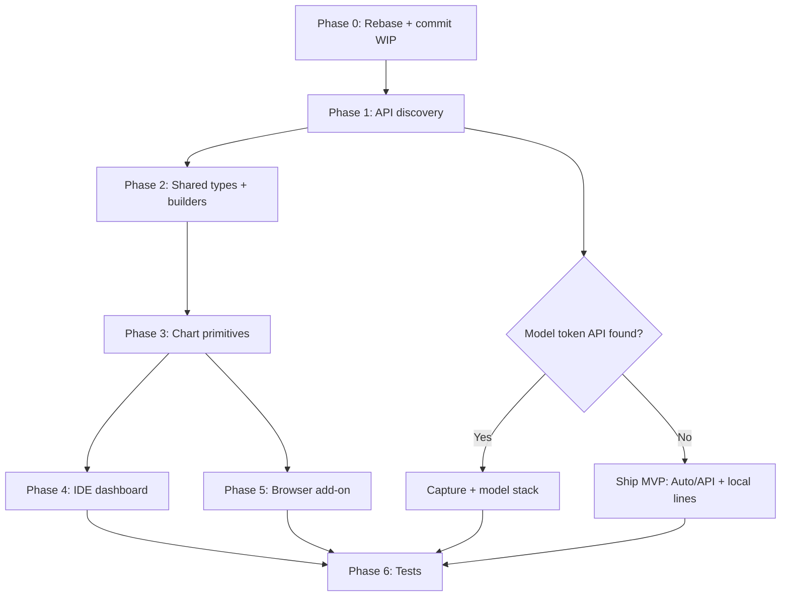

# Plan: Dynamic usage dashboard (Cursor-native analytics in IDE + browser add-on)

**Branch:** `fix/unified-account-mail-issues` → rebase onto `main`, then `feat/dynamic-usage-dashboard`  
**Date:** 2026-09-03  
**Reference UI:** Cursor dashboard screenshot (cumulative tokens, model breakdown, date range, KPI cards)  
**Design direction:** Mission Control / Cognitum glass panels (`website/shared/tokens.css`) + existing add-on layout (gauge-first, compact)

---

## Terminal status (user deploy — verified)

From `terminals/4.txt`:

| Step | Result |
|------|--------|
| `npm run admin:deploy:fast` | ✅ Built + deployed to `https://cursor-dev.lorapok.tech` |
| `node website/admin/scripts/sync-resend-cred-vault.mjs` | ✅ Pulled `RESEND_API_KEY` from Pages runtime → cred vault (`re_4Bb***`) |
| Bootstrap route | ✅ `resend-vault-bootstrap.ts` live after deploy |

**Follow-up (optional):** `gh secret set RESEND_API_KEY --env admin-production --body "$(cred get cursor resend_api_key)"` for CI.

**Uncommitted WIP on branch** (commit before or with dashboard work):

- Account switch sync animation (`dashboardView.ts`, popup `App.tsx`)
- 401 error copy (`usageMonitor.ts`, `monitor.ts`)
- `sync-resend-cred-vault.mjs` + `resend-vault-bootstrap.ts`

---

## Goals

| # | Request | Success criteria |
|---|---------|------------------|
| 1 | Rebase with `main` first | Branch fast-forwarded/rebased; no conflict with `821bca13` |
| 2 | Complete dynamic data like Cursor dashboard | KPI row + time-series chart + per-model breakdown where data exists |
| 3 | Admin panel design in IDE extension | Glass cards, mesh accents, KPI typography from Mission Control |
| 4 | Browser add-on keeps current layout | Gauge + meters stay; add animated detail chart + breakdown tooltip |
| 5 | Animated presentation | Draw-in paths, staggered KPI fade, hover tooltips; `prefers-reduced-motion` |

---

## Current state vs target (gap analysis)

### What we have today

| Surface | Charts | Data |
|---------|--------|------|
| **IDE** (`dashboardView.ts`) | Semi gauge, progress bars, single-line sparkline (`includedPercent` only) | `usage-summary`, `full_stripe_profile`, local DB lines/sessions |
| **Browser** (`popup/App.tsx`) | `AnimatedGauge`, `SpendChart` (animated line), meter fills | Same APIs + poll `history[]` |
| **Admin** (`TrafficTrendGraph.tsx`) | Area curve, metric tabs, hover tooltip | Site traffic (not usage) — **visual pattern to port** |

### What Cursor native dashboard shows (screenshot)

- **KPI cards:** Total tokens, Included, On-demand
- **Stacked area chart:** Cumulative tokens over date range
- **Group by:** Model (composer-2.5, claude-opus-5-thinking-low, …)
- **Tooltip:** Daily breakdown with % per model + daily/cumulative totals
- **Range filters:** 1d / 7d / 30d / MTD / custom

### Data availability (critical)

| Native feature | Available now? | Source |
|----------------|----------------|--------|
| Plan quota % / units | ✅ | `usage-summary` → `budget` |
| On-demand USD | ✅ | `onDemand.used` |
| Auto vs API % | ✅ snapshot + `history[]` | Not charted yet |
| **Per-model token usage** | ❌ | Not in `usage-summary`; needs API discovery or dashboard capture |
| **Cumulative tokens** | ❌ | Not in public APIs used today |
| Daily activity (lines) | ✅ IDE only | `aiCodeTracking.dailyStats.*` in `state.vscdb` |
| Poll trend | ✅ partial | `UsageHistoryPoint` (max 90 pts, 8h dedupe) |

**Conclusion:** Full parity with Cursor’s token-by-model chart requires a **discovery + capture** phase. MVP can ship immediately with quota/Auto/API/USD + local daily lines; Phase 2 adds model tokens once endpoint or capture is proven.

---

## Phase 0 — Git hygiene (first)

```bash
git fetch origin main
git stash push -m "wip-sync-animation-resend"   # if dirty
git rebase origin/main                          # branch is 1 commit ahead; should be clean
git stash pop                                   # if stashed
# Commit WIP: account sync UI + resend vault sync + bootstrap route
```

Open **new PR** or extend **PR #116** only after rebase + scoped tests green.

---

## Phase 1 — Data discovery (read-only probe)

**Goal:** Find how Cursor dashboard loads model/token series.

### 1.1 Network capture on `cursor.com/dashboard`

- Use real Maizied Chrome + Browser MCP (or manual DevTools)
- Filter XHR/fetch while opening Usage tab
- Document endpoints, auth headers, response JSON shape
- Compare with existing `api2.cursor.sh/auth/*` base

### 1.2 Browser extension passive capture (if API found)

**Files:** `browser-extension/src/content/auth-capture.ts` (extend pattern)

- On `cursor.com/dashboard` (or usage subpath), intercept matching responses
- Store anonymized series in `chrome.storage` keyed by `activeAccountId`
- Expose via `DashboardSnapshot.usageAnalytics` (new optional field)

### 1.3 IDE local mining extension

**Files:** `src/cursorLocalStore.ts`

- Export `readDailyStatsSeries(productFolder, cycleStart, cycleEnd)` → `DailyCodeStats[]`
- Parse `composerHeaders.value` JSON for `modelName` / token fields if present (probe real DB)
- Do **not** assume tokens exist until validated on real `state.vscdb`

### 1.4 Deliverable

`docs/wiki/Usage-Analytics.md` (or procedure note): endpoint URLs, fields, fallback behavior, privacy boundaries.

---

## Phase 2 — Shared data model (`packages/shared`)

**Files:** `packages/shared/src/cursorApi.ts`, `packages/shared/src/usageAnalytics.ts` (new)

```ts
export type UsageRangePreset = "1d" | "7d" | "30d" | "mtd" | "cycle";

export interface UsageSeriesPoint {
  t: number;           // epoch ms
  label: string;       // "Aug 31"
  includedUnits?: number;
  autoPercent?: number;
  apiPercent?: number;
  spentUsd?: number;
  tokensTotal?: number; // when available
  byModel?: Record<string, number>; // model id → tokens or units
}

export interface UsageAnalyticsSummary {
  totalTokens?: number;
  includedTokens?: number;
  onDemandTokens?: number;
  range: UsageRangePreset;
  groupBy: "model" | "autoApi" | "surface";
  series: UsageSeriesPoint[];
  models: { id: string; label: string; color: string }[];
}

// Extend DashboardSnapshot
usageAnalytics?: UsageAnalyticsSummary | null;
```

**Builders:**

- `buildAnalyticsFromHistory(history, budget, range)` — MVP, no new API
- `buildAnalyticsFromDailyStats(dailyStats[], range)` — IDE local
- `buildAnalyticsFromCapturedPayload(raw)` — Phase 2 when capture exists

**History enhancement (optional):** add `includedUsed`, `bonusUsed` to `UsageHistoryPoint` for richer stacks.

---

## Phase 3 — Shared chart primitives

**New:** `packages/shared/src/charts/` (framework-agnostic SVG helpers, no React)

| Module | Purpose |
|--------|---------|
| `stackedArea.ts` | Normalize series → SVG paths per layer + cumulative stack |
| `smoothPath.ts` | Cubic Bézier (port from `TrafficTrendGraph.tsx`) |
| `colors.ts` | Model palette (match screenshot: green composer, blue fast, gold default, …) |
| `formatTokens.ts` | `662.3M`, `120.6M` compact notation |

**Browser React wrappers:** `browser-extension/src/components/UsageAnalyticsChart.tsx`  
**IDE:** inline JS in `dashboardView.ts` calling shared builders (bundled via extension compile) OR thin `dist/charts` copy from shared package.

**Animation conventions** (from admin + popup):

- Path draw-in: `stroke-dashoffset` 1s ease-out
- Area fill fade: opacity 0→1 0.5s
- KPI cards: `fade-slide-up` + stagger 50ms
- Tooltip: follow hover index; respect `prefers-reduced-motion`

---

## Phase 4 — IDE extension dashboard

**Files:** `src/dashboardView.ts` (primary), `src/usageMonitor.ts`, `src/cursorLocalStore.ts`

### 4.1 Visual refresh (admin-aligned)

- Import / inline `website/shared/tokens.css` variables (`--color-bg-base`, `--color-accent`, glass panel)
- Replace flat `.card` with `glass-panel` + subtle mesh background on header
- **KPI row** (3 cards): Total usage, Included pool, On-demand spend — mirror screenshot layout

### 4.2 “Your Usage” chart section

- Header: date range chips (`7d` default, `30d`, `Cycle`, `MTD`)
- `Group by` select: `Model` (when data exists) | `Auto / API` | `Tab / Composer` (local)
- **Stacked area chart** with hover tooltip:
  - MVP: Auto + API layers from `history[]`
  - IDE+: tab/composer accepted lines from daily stats
  - Phase 2: model layers from captured API
- Legend row with color dots (admin donut legend pattern)

### 4.3 Keep existing sections

- Account switcher + sync animation (already WIP)
- Budget gauge, billing reset, local insights, recovery tools — unchanged placement below chart

### 4.4 Wiring

- `usageMonitor.refresh()` → compute `usageAnalytics` via shared builders
- Pass through `DashboardSnapshot` to webview `render()`

---

## Phase 5 — Browser add-on (layout preserved, details added)

**Files:** `browser-extension/src/popup/App.tsx`, new `UsageAnalyticsChart.tsx`, `styles.css`

**Constraint:** Keep current structure — header → account switcher → gauge card → chart → meters → breakdown.

| Change | Detail |
|--------|--------|
| **After gauge** | Insert compact KPI strip (3 mini stats) |
| **Replace/enhance `SpendChart`** | Stacked area + tooltip; keep section label “Usage over time” |
| **Range chips** | Small pill row above chart (7d / 30d) |
| **Group by** | Dropdown when `usageAnalytics.models.length > 1` |
| **Animation** | Reuse `SpendChart` draw-in + meter transitions already in popup CSS |

**Data path:** `monitor.ts` builds `usageAnalytics` from `history` + optional captured dashboard payload (content script).

**No local DB in browser** — model breakdown only after Phase 1 capture or future API.

---

## Phase 6 — Testing & verification

### Unit tests

| Test file | Covers |
|-----------|--------|
| `packages/shared/src/__tests__/usageAnalytics.test.ts` | Range filter, stack normalization, token formatting |
| `packages/shared/src/__tests__/stackedArea.test.ts` | SVG path generation |
| `tests/test_usage_monitor_lifecycle.test.js` | Snapshot includes `usageAnalytics` |
| `browser-extension/tests/test-analytics.js` | Builder with mock history |

### Manual E2E

1. **IDE:** F5 → switch accounts → verify sync spinner + chart updates
2. **IDE:** With Cursor DB present → Group by Tab/Composer shows daily local series
3. **Browser:** Popup → gauge unchanged; new chart animates on refresh
4. **Reduced motion:** OS setting disables path animation
5. **401:** Expired token shows reconnect copy (WIP)

### Regression

```bash
npm run compile
npm test
npm run browser-ext:test
cd website/admin && npm test
```

---

## Implementation order (recommended)



**MVP scope (ship first PR):** Phases 0–3 + 4.1–4.2 (Auto/API stack) + 5 (enhanced chart, no model tokens)  
**Follow-up PR:** Model-level tokens after Phase 1 discovery + capture

---

## Critical files

| Area | Paths |
|------|-------|
| Shared types/API | `packages/shared/src/cursorApi.ts`, `usageAnalytics.ts` |
| IDE UI | `src/dashboardView.ts`, `src/usageMonitor.ts` |
| Local data | `src/cursorLocalStore.ts` |
| Browser UI | `browser-extension/src/popup/App.tsx`, `components/UsageAnalyticsChart.tsx` |
| Browser data | `browser-extension/src/lib/monitor.ts`, `content/auth-capture.ts` |
| Admin reference | `website/admin/src/components/ui/TrafficTrendGraph.tsx`, `website/shared/tokens.css` |
| Design tokens | `browser-extension/src/popup/styles.css` |

---

## Risks & mitigations

| Risk | Mitigation |
|------|------------|
| Cursor token API undocumented / changes | Capture + graceful fallback to Auto/API; never block dashboard |
| Poll history too sparse for daily charts | Add calendar-day rollup from local `dailyStats` on IDE |
| Webview bundle size | Keep charts as vanilla SVG helpers, no chart.js |
| Model names differ per account | Normalize labels in builder; stable color hash per model id |
| Security (capture on cursor.com) | Store aggregates only; no raw chat; same trust model as token capture |

---

## Procedure

```bash
node scripts/procedure-init.mjs --title "Dynamic usage dashboard" --plan plan/c3a8f1e2_dynamic-usage-dashboard-plan.md --component extension
```

Update procedure Progress after Phase 0 rebase and after MVP merge.
