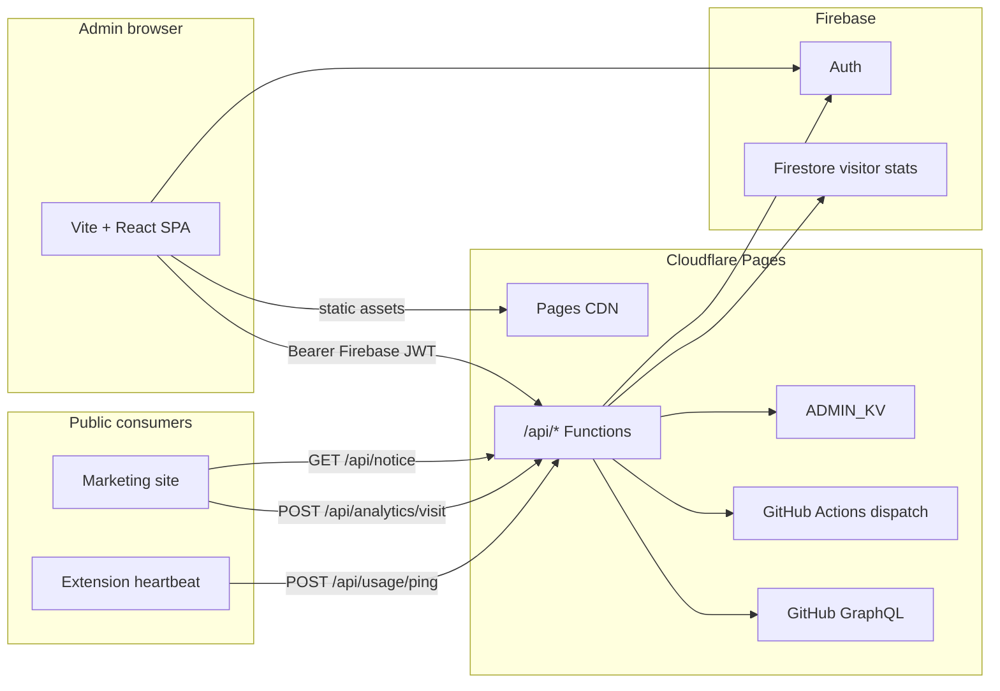

# Mission Control — Admin Panel

**Cursor Curse Monitor** operations dashboard: marketplace sync, deployments, notices, community tools, and analytics.

| | |
|---|---|
| **Production URL** | https://cursor-dev.lorapok.tech |
| **Pages project** | `cursor-monitor-admin` (Cloudflare Lorapok Facility account) |
| **Auth** | Firebase — Google sign-in + email magic link |
| **API** | Co-located Cloudflare Pages Functions in `functions/api/` |

---

## Architecture



### API routes (Pages Functions)

| Route | Auth | Purpose |
|-------|------|---------|
| `GET /api/notice` | Public | Active site banner (CORS) |
| `GET/POST/PUT/DELETE /api/notices` | Admin | Notice catalog (enable / disable / delete) |
| `GET /api/health` | Public | Liveness + GitHub check |
| `POST /api/deploy` | Admin | Trigger deployment workflow |
| `GET /api/analytics/stats` | Admin | Visitor + click totals |
| `POST /api/analytics/visit` | Public | Marketing site beacon |
| `POST /api/usage/ping` | Public | Opt-in extension heartbeat |
| `GET /api/discussions` | Admin | GitHub Discussions feed |

Deprecated: `website/admin-api/` standalone Worker — **do not deploy**.

---

## Local development

```bash
cd website/admin
npm install
cp .env.example .env    # optional GITHUB_TOKEN for deploy dispatch
npm run dev             # http://localhost:5173
```

The Vite dev server uses `vite-dev-api.mjs` to emulate Pages Functions at `/api/*` and serves `site-data.json` / `seo.json` without Cloudflare or Firebase in the loop for most reads.

### Commands

| Script | Description |
|--------|-------------|
| `npm run dev` | Vite dev server + local API |
| `npm test` | Vitest (components + dev API) |
| `npm run build` | `tsc -b && vite build` (prebuild regenerates site data) |
| `npx oxlint` | Lint (use this — `npm run lint` expects eslint) |
| `npm run deploy:pages` | Manual `wrangler pages deploy` |

### Environment

Public Firebase config ships in `.env` for local auth. Production secrets are set in **Cloudflare Pages → Settings → Environment variables**:

- `GITHUB_TOKEN` — workflow dispatch
- `FIREBASE_PROJECT_ID` — `cursor-curse-by-lorapok`
- `ADMIN_MASTER_EMAIL` — `mdshuvo40@gmail.com`
- `SITE_DATA_URL` — marketing `site-data.json` URL

KV namespace IDs belong in `wrangler.toml`.

---

## Notices

Generated marketing copy is seeded into the notice catalog once (`generated-dev-notice`). Admins can:

- **Enable** one notice at a time on the public banner
- **Disable** without deleting
- **Delete** from the catalog

Public `GET /api/notice` returns the active item. The marketing site uses live API output when reachable and only falls back to `site-data.json` when the API is down.

---

## Deploy

**Automatic:** push to `main` runs `admin-ci` then `admin-deploy` when GitHub secrets `CLOUDFLARE_API_TOKEN` and `CLOUDFLARE_ACCOUNT_ID` are set.

**Manual:**

```bash
npm run build
npx wrangler pages deploy dist --project-name=cursor-monitor-admin --branch=main
```

DNS: `cursor-dev.lorapok.tech` CNAME → `cursor-monitor-admin-2x8.pages.dev` (proxied).

Add authorized domains in Firebase Console for `cursor-dev.lorapok.tech` and your `*.pages.dev` host.

Full checklist: [DEPLOYMENT.md](../../DEPLOYMENT.md) · QA: [docs/ADMIN_MANUAL_TEST.md](../../docs/ADMIN_MANUAL_TEST.md)

---

## Project layout

```
website/admin/
├── src/
│   ├── components/pages/   # Overview, Notices, Deployments, …
│   ├── components/ui/        # Cards, DataTable, ChannelSyncStrip, …
│   ├── hooks/                # useSiteData, useVisitorStats, …
│   └── lib/                  # api.ts, firebase, site-data types
├── functions/api/            # Production Pages Functions
│   └── _shared/              # auth, notices, mail helpers
├── vite-dev-api.mjs          # Local API emulation
├── wrangler.toml             # KV + Pages bindings
└── firebase.json             # Firestore rules deploy target
```

---

## License

MIT — same as the parent repository.
