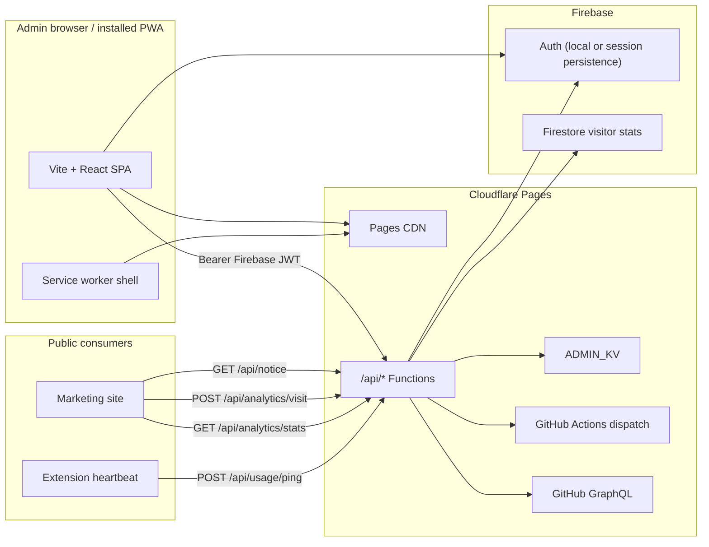

# Mission Control — Admin Panel

**Cursor Curse Monitor** operations dashboard for Lorapok Labs: marketplace sync, deployments, notices, community tools, live analytics, and SEO health.

| | |
|---|---|
| **Production URL** | https://cursor-dev.lorapok.tech |
| **Marketing site** | https://maijied.github.io/Cursor-Curse-Monitor-by-Lorapok/ |
| **Pages project** | `cursor-monitor-admin` (Cloudflare Lorapok Facility account) |
| **Auth** | Firebase — Google sign-in, email magic link, optional **Keep me signed in** |
| **API** | Co-located Cloudflare Pages Functions in `functions/api/` |
| **Install** | Progressive Web App (Android / iOS / desktop) |

---

## Features

| Area | What you get |
|------|----------------|
| **Overview** | Marketplace sync status, live visitor KPIs, extension heartbeat counts |
| **Notices** | Enable / disable / delete public site banners |
| **Deployments** | Trigger CI/CD, view workflow runs, rollback releases |
| **Marketplace** | Open VSX + VS Code version parity and sync health |
| **Discussions** | GitHub Discussions feed and reply tooling |
| **SEO** | Live `seo.json` manifest, sitemap status, canonical URL checks |
| **API Explorer** | Interactive route tester for Pages Functions |
| **Settings** | Connected services, health checks, environment summary |
| **PWA** | Install to home screen with colorful Lorapok logo and offline shell |

---

## Architecture



### API routes (Pages Functions)

| Route | Auth | Purpose |
|-------|------|---------|
| `GET /api/health` | Public | Liveness + GitHub connectivity |
| `GET /api/notice` | Public | Active site banner (CORS) |
| `GET/POST/PUT/DELETE /api/notices` | Admin | Notice catalog |
| `GET/POST /api/admins` | Admin | Team member management |
| `POST /api/deploy` | Admin | Trigger deployment workflow |
| `POST /api/rollback` | Admin | Roll back a release |
| `GET /api/analytics/stats` | Admin | Visitor + engagement totals |
| `POST /api/analytics/visit` | Public | Marketing site beacon |
| `POST /api/usage/ping` | Public | Opt-in extension heartbeat |
| `GET /api/usage/stats` | Public | Live extension user counts |
| `GET /api/discussions` | Admin | GitHub Discussions feed |
| `POST /api/discussions` | Admin | Create discussion replies |
| `GET /api/marketplace/sync` | Admin | Marketplace version parity |
| `GET /api/releases` | Admin | GitHub release list |
| `GET /api/workflows/runs` | Admin | Recent workflow runs |
| `GET /api/activity` | Admin | API activity log |
| `GET/PUT /api/community/config` | Admin | Community feature flags |
| `POST /api/subscribe` | Public | Mailing-list signup |

Deprecated: `website/admin-api/` standalone Worker — **do not deploy**.

---

## Authentication

Sign-in options on `/login`:

1. **Google** — one-click OAuth popup
2. **Email magic link** — passwordless link sent to inbox

**Keep me signed in** (default on) stores the Firebase session in browser local storage so the installed PWA stays signed in across restarts. When unchecked, the session uses browser session storage and ends when the tab or installed app is closed.

Authorized emails are checked against Firestore `admins` or the master admin address configured in environment variables.

---

## Progressive Web App (PWA)

Mission Control can be installed from Chrome (Android / desktop) or Safari (iOS):

- **Manifest** — `public/manifest.webmanifest` with colorful `logo.svg` / `logo.png` icons
- **Start URL** — `/login?source=pwa` so cold starts land on the login route
- **Service worker** — `public/sw.js` precaches the shell and falls back to `index.html` for SPA navigation (fixes deep links on Android)
- **Install prompt** — sidebar **Install app** button when the browser supports `beforeinstallprompt`

After deploying manifest or service-worker changes, users should reinstall the PWA or clear site data to pick up the new shell cache (`ccm-admin-shell-v3`).

---

## Local development

```bash
cd website/admin
npm install
cp .env.example .env    # optional GITHUB_TOKEN for deploy dispatch
npm run dev             # http://localhost:5173
```

The Vite dev server uses `vite-dev-api.mjs` to emulate Pages Functions at `/api/*` and serves `site-data.json` / `seo.json` without Cloudflare in the loop for most reads.

### Commands

| Script | Description |
|--------|-------------|
| `npm run dev` | Vite dev server + local API |
| `npm test` | Vitest (components + dev API) |
| `npm run build` | `tsc -b && vite build` (prebuild regenerates site data) |
| `npx oxlint` | Lint (use this — `npm run lint` expects eslint) |
| `npm run deploy:pages` | Manual `wrangler pages deploy` |

### Environment

Public Firebase config ships in `.env` for local auth. Production secrets are set in **Cloudflare Pages → Settings → Environment variables**:

| Variable | Purpose |
|----------|---------|
| `GITHUB_TOKEN` | Workflow dispatch + GraphQL |
| `FIREBASE_PROJECT_ID` | `cursor-curse-by-lorapok` |
| `ADMIN_MASTER_EMAIL` | Master admin bypass |
| `SITE_DATA_URL` | Marketing `site-data.json` URL |
| `VITE_MARKETING_SITE_URL` | **Back to website** link target |

KV namespace IDs belong in `wrangler.toml`.

Add authorized domains in Firebase Console for `cursor-dev.lorapok.tech` and your `*.pages.dev` host.

---

## Notices

Generated marketing copy is seeded into the notice catalog once (`generated-dev-notice`). Admins can:

- **Enable** one notice at a time on the public banner
- **Disable** without deleting
- **Delete** from the catalog

Public `GET /api/notice` returns the active item. The marketing site uses live API output when reachable and only falls back to `site-data.json` when the API is down.

---

## Deploy

**Automatic:** push to `main` runs `admin-ci` then `admin-deploy` when GitHub secrets `CLOUDFLARE_API_TOKEN` and `CLOUDFLARE_ACCOUNT_ID` are set.

**Manual:**

```bash
npm run build
npx wrangler pages deploy dist --project-name=cursor-monitor-admin --branch=main
```

DNS: `cursor-dev.lorapok.tech` CNAME → `cursor-monitor-admin-2x8.pages.dev` (proxied).

Full checklist: [DEPLOYMENT.md](../../DEPLOYMENT.md) · QA: [docs/ADMIN_MANUAL_TEST.md](../../docs/ADMIN_MANUAL_TEST.md)

---

## Project layout

```
website/admin/
├── src/
│   ├── components/pages/     # Overview, Notices, Deployments, SEO, ApiExplorer, …
│   ├── components/ui/        # Cards, DataTable, VisitorStatsPanel, InstallAppButton, …
│   ├── hooks/                # useSiteData, useVisitorStats, useUsageStats, …
│   └── lib/                  # api.ts, firebase, auth-session, marketing-site
├── public/
│   ├── manifest.webmanifest  # PWA manifest
│   ├── sw.js                 # Service worker (SPA offline fallback)
│   └── assets/               # logo.svg, logo.png, icons (synced from media/)
├── functions/api/            # Production Pages Functions
│   └── _shared/              # auth, notices, mail helpers
├── vite-dev-api.mjs          # Local API emulation
├── wrangler.toml             # KV + Pages bindings
└── firebase.json             # Firestore rules deploy target
```

Sync admin icons from the repo root:

```bash
npm run sync:icons    # from repository root
```

---

## License

Proprietary — Lorapok Labs product. See [LICENSE](../../LICENSE) in the repository root. Founder: Mohammad Maizied Hasan Majumder. Personal download/install/use only; no sale or modification without written permission.
